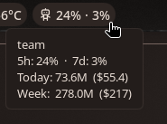
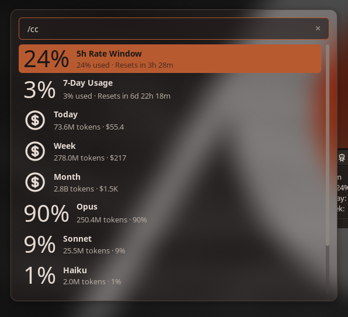
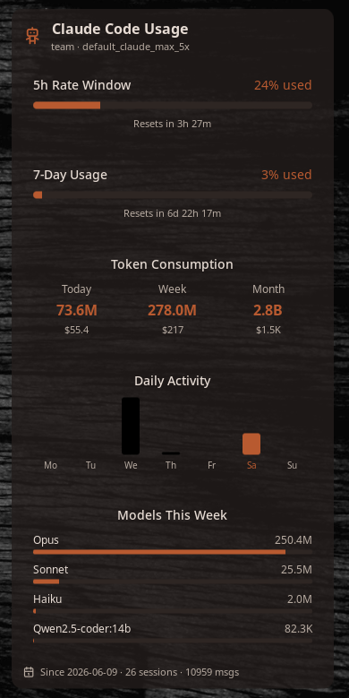

# Noctalia v5 — Claude Code Usage

A [Noctalia](https://noctalia.dev) v5 plugin that monitors your Claude Code subscription
usage (rate limits, token consumption, estimated cost, daily activity, per-model and
per-profile breakdowns). Ported from the
[Dank Material Shell plugin](https://github.com/titeya/dms-claudecode) by Nicolas Bellamy.

This repository is a **Noctalia plugin source**: the root `catalog.toml` indexes the
plugins, and each plugin lives in its own subdirectory (here, `claudecode/`).

## Screenshots

**Bar pill** (left-click opens the launcher breakdown; hover for a summary):



<table>
  <tr>
    <td valign="top" width="50%">
      <b>Launcher breakdown</b> — type <code>/cc</code> or left-click the pill<br><br>
      
    </td>
    <td valign="top" width="50%">
      <b>Desktop panel</b><br><br>
      
    </td>
  </tr>
</table>

## Install

Add this repo as a plugin source, then enable the plugin:

```bash
noctalia msg plugins source add jrohland git https://github.com/jrohland/noctalia-v5-claudecode
noctalia msg plugins enable jrohland/claudecode
```

Then add the **Claude Code Usage** bar widget from the Add-widget picker. **Left-click** the
pill to open the usage breakdown in the launcher (or type `/cc`); **right-click** to refresh.
For the full visual panel, add the desktop widget from the desktop-widget editor
(`noctalia msg desktop-widgets-edit`). Configure the refresh interval and currency under
Settings → Plugins.

Update later with `noctalia msg plugins update`, or remove the source with
`noctalia msg plugins source remove jrohland`.

## Requirements

- Noctalia ≥ 5.0.0
- `jq`, `curl`
- An authenticated Claude Code install (`~/.claude/.credentials.json`)

See [`claudecode/README.md`](claudecode/README.md) for plugin details and architecture.

## License

[MIT](LICENSE)
